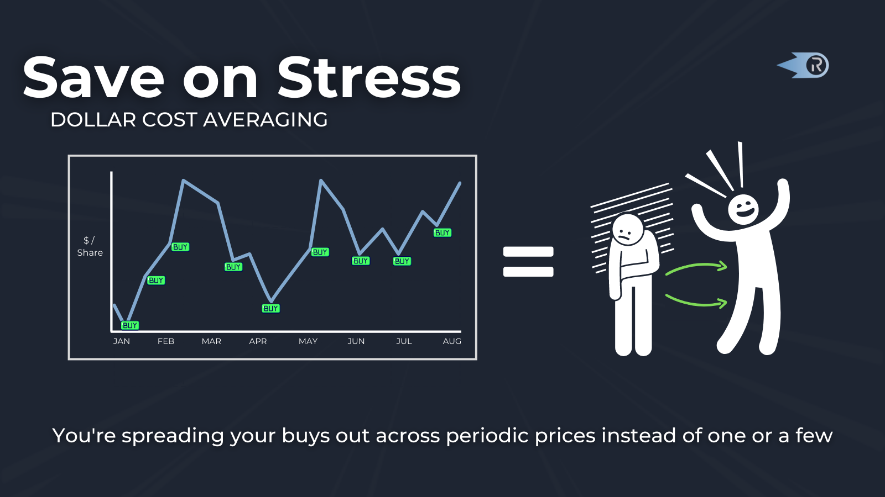

# RIC Rewards Twitter Campaign 

## Objective
* Get the word out that RIC rewards resume July 1st
* Share information about how to get started streaming on Ricochet

## Tweets

### 2022-06-24
1/ Mark your calendars for July 1!

Only 6 days left until the next round of RIC rewards resumes.

All Ricochet users will receive RIC rewards for dollar-cost averaging into (or out of) ETH, WBTC, and MATIC

Get started now: https://app.ricochet.exchange/#/ref/rewards

2/ How to participate:
- DCA into or out of ETH, WBTC, MATIC between July 1 and October 1 
- Receive a share of the rewards proportional to your flow rate
- Each Market will distribute 100K RIC per month for the next 3-months

Get started now: https://app.ricochet.exchange/#/ref/rewards

### 2022-06-27
1/ Only 4 days left until RIC rewards resume! Starting July 1st, everyone using Ricochet to buy/sell ETH, WBTC, and MATIC will receive RIC.

Ricochet's DCA triggers buys/sells every 15 minutes so you never miss a dip. Stop stressing, DCA and chill 

Try now: https://app.ricochet.exchange/#/ref/rewards

2/ How to participate:

- Use Ricochet to dollar-cost average into or out of WBTC, ETH, or MATIC from July 1st to October 1st

- You'll receive RIC rewards in proportion to your flow rate every 15 minutes

- Each market is allocated 100K per month

### 2022-06-28
TBD 

### 2022-06-30
TBD
